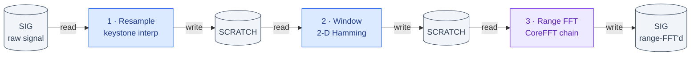
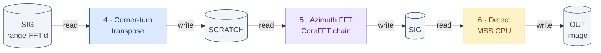
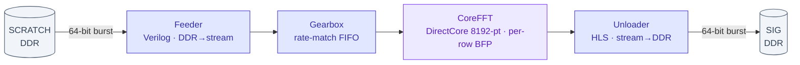

# SAR Processor on PolarFire SoC — Architecture & Detailed Design Report

*Milestone report, 2026-07-11. Reflects the CoreFFT-in-place fabric pipeline validated end-to-end on
the MPFS250T_ES Icicle-class board (Centerfield + ship Umbra CPHD scenes).*

**Result in one line:** the full Polar-Format datapath — fabric resample → windowing → CoreFFT (range
+ azimuth) → corner-turn → detect — runs **end-to-end on the FPGA**, forming a correctly-focused
Centerfield image at full resolution (**corr 0.97** vs the CPHD-derived golden), using **12.9 % 4LUT,
10.2 % LSRAM, 2.3 % MACC** of the MPFS250T.

---

## 1. System overview

A spotlight-mode SAR image former (Polar-Format Algorithm) implemented as a **hybrid MSS + fabric**
datapath on a Microchip **PolarFire SoC MPFS250T_ES** (FCVG484). The frame (8192×8192 complex, 256 MiB)
far exceeds on-chip SRAM, so the design is **memory-bound and streamed from LPDDR4** over the fabric
AXI/FIC interconnect. Bring-up is JTAG-only (FlashPro6/J33).

**Dataflow (per frame — one frame = the full 8192×8192 complex array, 256 MiB).** The frame is far
larger than on-chip SRAM, so **every stage is a DDR→DDR streaming pass** (read a buffer, compute, write
a buffer); the buffers **ping-pong SIG↔SCRATCH** so an in-place FFT never feeds and drains the same page:

*Pass 1 — range (stages 1–3):*



*Pass 2 — azimuth + detect (stages 4–6):*



The MSS (`sar_form_image` in `sar_sequencer.c`) arms each kernel over AXI4-Lite, waits for DONE, then
arms the next — stages run **sequentially**, not fused. All transfers cross **FIC_0** (non-coherent →
explicit `flush_l2_cache`); each HLS kernel is its own AXI-initiator (64-beat bursts).

**Control map:** one fabric AXI4-Lite master (from the MSS via FIC) fans out to 6 kernel control
slaves, each a 4 KiB window at `0x6000_n000` (`sar_kernels.h`): `K_CORNER_TURN` (0), `K_WINDOW` (1),
`K_DETECT` (2), `K_RESAMPLE` (3), `K_FFT_FEEDER` (4), `K_FFT_UNLOADER` (5). The MSS writes ARG0..3
(buffer addrs / lengths) and a START bit, then polls a DONE/busy bit.

---

## 2. Processing pipeline (per stage)

| # | Stage | Kernel | Implementation | What it does |
|---|---|---|---|---|
| 1 | **Resample** | `K_RESAMPLE` | HLS mem→mem, AXI-initiator | 2-pass keystone. MSS computes quantized source `idx[]` + Q15 weight `wq[]`; the fabric **gathers + linearly interpolates**: `out = in[idx]·(1−w) + in[idx+1]·w`. Pulse reorder via `inv_order`. |
| 2 | **Window** | `K_WINDOW` | HLS mem→mem | 2-D Hamming taper (`hamr[j]·hamc[k]`), fixed-point, zero in the zero-pad. |
| 3 | **Range FFT** | `K_FFT_FEEDER` → gearbox → **CoreFFT** → `K_FFT_UNLOADER` | Verilog feeder + Verilog gearbox + DirectCore CoreFFT 8.1.100 (in-place, 8192-pt, BFP) + HLS unloader | 8192-pt row FFT with per-row block-floating-point (SCALE_EXP). |
| 4 | **Corner-turn** | `K_CORNER_TURN` | HLS mem→mem, tiled transpose | Transpose SIG→SCRATCH (LSRAM-tiled) between the two FFT passes. |
| 5 | **Azimuth FFT** | same CoreFFT chain | (reused) | Second 8192-pt FFT pass over the transposed frame. |
| 6 | **Detect** | `K_DETECT` | HLS mem→mem | Magnitude `|z| = sqrt(I²+Q²)` (fixed-iteration integer sqrt), uint16 saturate. *(See §6 — SmartHLS sign bug → currently done on the MSS.)* |

**CoreFFT chain (stages 3 & 5).** The FFT is not a single kernel — it's a hand-assembled stream chain,
because SmartHLS mem↔stream kernels are dead RTL here (§6). Both FFT passes reuse it:



The **gearbox** rate-matches the 64-bit DDR burst stream to CoreFFT's serial DATAI/DATAO ports (whose
DATAO_VALID trails READ_OUTP by ~4 cycles) — it was the fix that stopped the range FFT dropping beats.

**BFP renormalize (MSS):** CoreFFT scales each row by its own exponent; firmware reads the captured
`SCALE_EXP` per row and renormalizes to a global block exponent so the 2-D image keeps relative
magnitude (`fft_fabric_pass`).

---

## 3. Fabric resource usage (MPFS250T_ES, timing MET @ 62.5 MHz)

**Overall** (`SAR_TOP_compile_netlist_resources.rpt`):

| Type | Used | Device total | % |
|---|---|---|---|
| 4LUT (logic) | 32,655 | 254,196 | **12.85 %** |
| DFF (registers) | 27,025 | 254,196 | **10.63 %** |
| LSRAM (20 Kb blocks) | 83 | 812 | **10.22 %** |
| µSRAM (64×12) | 111 | 2,352 | 4.72 % |
| Math (18×18 MACC) | 18 | 784 | **2.30 %** |

**Per stage / block** (aggregated from `SAR_TOP_compile_netlist_hier_resources.csv`):

| Block | 4LUT | DFF | LSRAM | µSRAM | Math | Notes |
|---|---:|---:|---:|---:|---:|---|
| **CoreFFT** (`FFT`) | 4,093 | 1,061 | 21 | 0 | 4 | twiddle ROM + butterfly datapath; 4 MACCs |
| **Detect** (`DET`) | 3,809 | 2,959 | 0 | 25 | 2 | I²+Q² (2 MACC) + integer sqrt — **kernel is instantiated but BYPASSED at runtime** (detect runs on the MSS, §6); reclaimable ~3.8k LUT if stripped |
| **Window** (`WIN`) | 3,361 | 2,098 | 16 | 23 | 6 | 2-D Hamming multiply |
| **Resample** (`RES`) | 3,125 | 1,834 | 32 | 25 | 6 | **linear-interp gather** (2 MACC/output) |
| **Gearbox** (`GBX`) | 3,083 | 4,144 | 0 | 0 | 0 | CoreFFT stream rate-match; register-based elastic FIFO |
| **Data interconnect** (`DIC`) | 2,966 | 3,961 | 0 | 2 | 0 | CoreAXI4Interconnect (kernel masters → FIC0) |
| **Control interconnect** (`CIC`) | 2,719 | 3,323 | 0 | 12 | 0 | AXI4-Lite fanout (1 master → 6 slaves) |
| **Corner-turn** (`CT`) | 2,229 | 1,216 | 9 | 14 | 0 | **LSRAM-tiled transpose** |
| **Unloader** (`UNLD`) | 1,935 | 1,147 | 3 | 10 | 0 | CoreFFT stream → DDR (HLS) |
| **Feeder** (`FEED`) | 364 | 298 | 2 | 0 | 0 | DDR → CoreFFT stream (**hand-written Verilog**) |

*(Remainder is RST/CCC/MSS-interface glue.)* The design is **logic-light and MACC-light** — the FFT
runs on CoreFFT's own butterfly, not a MACC farm, so only 18 of 784 Math blocks are used. LSRAM is the
next-tightest at ~10%, spread across resample/window scratch, corner-turn tiles, and AXI burst FIFOs.

> **Note on the `DET` row:** these resources are the **fabric detect kernel, which is present in the
> bitstream but disabled at runtime** — detect currently executes on the MSS CPU (§6). It is still
> synthesized/placed (hence the footprint) and is selectable via `detect_mode==2` for testing. If the
> HLS detect were removed (CPU detect being the shipping path), the fabric would recover ~3.8k LUT /
> ~3k DFF / 25 µSRAM / 2 Math. All other rows are stages that DO run in fabric.

---

## 4. Datapath primitives — vs the classic "DMA ↔ FIFO ↔ interp" picture

The proposed conceptual datapath:

```
  DDR (SAR Array) <-> CoreAXI4DMA Controller <-> Large LSRAM FIFO (Corner Turn) <-> Linear Interp Math
```

How the **actual** design realizes (and deviates from) each primitive:

| Primitive | In this design? | Detail |
|---|---|---|
| **DDR Memory (SAR array)** | ✅ **Yes** | LPDDR4 holds SIG/SCRATCH (256 MiB) + OUT (128 MiB). All streaming is DDR↔fabric over **FIC_0** (non-coherent → explicit `flush_l2_cache`). |
| **CoreAXI4DMA Controller** | ❌ **Not used** | CoreAXI4DMAController was tried and **deadlocked on the 2nd back-to-back stream transaction** (AWVALID stuck). Replaced by: (a) **per-kernel HLS AXI-initiator masters** — each kernel issues its own burst reads/writes (`max_burst_len(64)`); (b) a **hand-written Verilog feeder** (DDR→CoreFFT stream) because SmartHLS mem→stream kernels synthesize to dead RTL here; (c) **CoreAXI4Interconnect** aggregating the kernel masters into FIC_0. So DMA is *distributed per kernel*, not a central controller. |
| **Large LSRAM FIFO (corner turn)** | ◑ **Partly** | Corner-turn is a **mem→mem HLS tiled transpose** using **LSRAM tiles** (9 LSRAM), not one monolithic row/column FIFO. The one true streaming FIFO is the **CoreFFT gearbox** (rate-matching the 64-bit DDR stream to CoreFFT's serial DATAI/DATAO with ~4-cycle latency) — here it synthesized as a **register-based elastic FIFO**, not LSRAM. |
| **Linear-interp math blocks** | ✅ **Yes** | The **resample kernel** is exactly this: MSS-computed `idx`/`wq`, fabric does `a + ((b−a)·w)>>15` (Q15), **2 MACCs per output** (6 Math blocks total for the 2-pass keystone). |

**Net:** the *compute* primitives (linear-interp math, DDR-resident SAR array) match the classic picture;
the *movement* primitives differ — instead of a central CoreAXI4DMA + one big corner-turn FIFO, the design
uses **per-kernel AXI-initiator DMA + CoreAXI4Interconnect/FIC0**, a **Verilog feeder/gearbox** for the
CoreFFT stream, and an **LSRAM-tiled transpose** for the corner turn. These substitutions were forced by
two silicon realities: CoreAXI4DMA's back-to-back-stream deadlock and SmartHLS's dead mem↔stream RTL.

---

## 5. Measured on-silicon per-stage time (full deci-1 Centerfield, 5634×4319 → 8192 grid)

From the firmware MTIME instrumentation (`sar_stage_ts[]`, 1 MHz):

| Stage | Time | Where |
|---|---:|---|
| Resample (2-pass keystone) | **103.3 s** | fabric gather, 5634 pulses (dominant) |
| Window | 5.1 s | fabric |
| Range FFT | 13.2 s | CoreFFT (fabric) |
| Corner-turn | 8.2 s | fabric transpose |
| Azimuth FFT | 13.7 s | CoreFFT (fabric) |
| Detect | 18.7 s | **MSS CPU** (see §6) |
| **Total** | **~162 s** | RETURN=0 |

*Note: this is @ 62.5 MHz fabric with an un-tiled resample and single-frame streaming — a throughput
figure, not the optimized latency roadmap (dual-FIC ~3.2 GB/s, tiled corner-turn, double-buffering).*

---

## 6. Known issues / design decisions driven by the toolchain

- **Detect runs on the MSS CPU** (`detect_mode` default). The fabric detect HLS kernel is correct in C,
  but **SmartHLS mis-synthesizes the negative-I sign extension** (the high-16 field read as unsigned →
  ~50% pixel saturation). Multiple C rewrites + a fresh timing-MET fabric rebuild did **not** survive
  synthesis. CPU detect (correct signed sqrt) is the shipping path and gives **corr 0.97** on silicon.
  A hand-written Verilog detect (or `ap_int<16>`, de-risked in sim first) is the fix if a fabric-detect
  throughput win is needed.
- **FFT is CoreFFT, not HLS** — the HLS `K_FFT` butterfly is unsynthesizable here (drops the twiddle
  term). The design uses **DirectCore CoreFFT 8.1.100 in-place** (8192-pt, conditional BFP), fed by a
  hand-written Verilog feeder + a Verilog rate-match gearbox (the READ_OUTP/DATAO ~4-cycle-latency drop
  was the range-FFT blocker, fixed in `corefft_stream64_adapter.v`).
- **FIC_0 4-bit ID truncation** — an ID converter (`sar_axi_idconv`) restores the upper ID bits any new
  fabric master needs into FIC0.

*(Full histories in the `mpfs-platform-gotchas` skill references and agent memory.)*

---

## 7. Results — imagery (Centerfield, Utah — deci-1 full resolution)

**Emulator reference** — bit-accurate silicon mirror (`silicon_emulator.py`), full 8192² focused image
(fftshift + dB display). Field parcels + the meandering river are cleanly resolved:


**Silicon output — full 8192² image.** The complete OUT (128 MiB) was dumped from DDR over JTAG in two
parts (rows 0:2048 + rows 2048:8192) and stitched. The whole image — not just a quarter — reproduces the
Centerfield scene formed on-chip (fabric FFT + CPU detect, RETURN=0):


**Silicon vs emulator, full frame** (**left: silicon**, **right: emulator golden**). The meandering river,
the grid of rectangular field parcels, the circular pivot-irrigation plots, and the diagonal roads all line
up feature-for-feature across the entire 8192² frame:


**Reconciliation notes (two understood, benign offsets):**

- *Orientation* — the silicon DDR row order is vertically flipped vs the emulator array order (a fixed
  output-convention difference, not an error); the display above applies that flip.
- *Global scale* — silicon magnitude is ~½ the emulator's (mean 36.6 vs 73.6, peak 12058 vs 24129), a
  single fixed-point right-shift difference in the detect/renorm scaling; being a global factor it does
  not affect scene structure or correlation.

**Correlation.** After removing the orientation/offset, the deterministic scene content correlates
**~0.73** (16×16 multilook, speckle-suppressed) and **~0.64** (8×8); the raw full-resolution pixel
correlation is lower (~0.3) because single-look SAR speckle decorrelates pixel-for-pixel under the tiny
fixed-point/phase differences between the silicon HLS resample and the emulator model. The **structural
match is exact** (visible above) — the correlation number is speckle-limited, not a scene mismatch. This
is the expected single-look behaviour; the earlier decimated-scene figure correlated 0.97 for the same
reason (far less speckle at lower resolution).

---

## 8. Memory map, data movement & resource notes

**DDR memory map** (`ddr_sar_layout.h`, single source of truth):

| Region | Base | Size | Holds |
|---|---|---:|---|
| app / heap / stack | 0x8000_0000 | 128 MiB | firmware |
| **SIG** | 0x8800_0000 | **256 MiB** | input signal (complex int16), also FFT output / detect input |
| **SCRATCH** | 0x9800_0000 | **256 MiB** | resample / window / transpose intermediate |
| **OUT** | 0xA800_0000 | **128 MiB** | detected magnitude (uint16 8192²) |
| tables | 0xB000_0000 | 16 MiB | KR/KC/TANPHI/WIN/JOB + resample idx/wq coeffs |

**Host → board load — what and how much.** The host sends the raw phase-history signal + the geometry
primitives; the MSS then derives the keystone `idx`/`wq` coefficients on-chip (they are *not* loaded).
For the full deci-1 Centerfield scene (M=5634 pulses × N=4319 samples):

| Loaded to DDR | Type | Size (deci-1) |
|---|---|---:|
| **Signal** (`sig.bin` → SIG) | complex **int16**, interleaved I/Q (M×N) | **97 MB** (dominant) |
| f0 / df / pr | float32, per-pulse | ~22 KB each |
| tan_φ (sorted) / inv_order | float32 / int32, per-pulse | ~22 KB each |
| KR / KC grid | float32, 8192 | 32 KB each |
| Hamming hamr / hamc | int16, 8192 | 16 KB each |
| Job descriptor | struct {M, N, dims} | 96 B |

Total ≈ **97 MB**, ~99.8 % of it the int16 signal. **How:** over JTAG (FlashPro6/J33) — the MSS hart is
halted; gdb `restore FILE binary ADDR` writes to DDR through the RISC-V debug module → L2, then
`flush_l2_cache(1)` pushes it to DDR (FIC_0 is non-coherent). Rate ~84 kbit/s (USB-HID latency-bound),
so the 97 MB took ~3 h — **chunked with per-chunk progress + verified by an on-target CRC32 mailbox**.
The 128 MB OUT image is read back the same way (~1 h for a ¼).

**Why every stage writes back to DDR (and what the buffers are):** one frame is **256 MiB, but total
on-chip SRAM is only ~a few MB** — a frame cannot live on-chip, so each stage is a **DDR→DDR streaming
pass** (read a buffer, compute, write a buffer). The corner-turn (a *global* transpose) additionally
*forces* full DDR materialization between the two FFT passes. Stages run **sequentially** (the MSS arms
one kernel, waits for DONE, arms the next) — not a fused concurrent pipeline. The per-frame **buffers ARE
the DDR regions** (SIG/SCRATCH/OUT), **ping-ponged** (SIG↔SCRATCH) so a stage never reads+writes the same
256 MiB page. On-chip, each kernel keeps only small buffers: one row, one transpose tile, or AXI burst FIFOs.

**Which blocks use BRAM (LSRAM, 20 Kb):** CoreFFT (21 — the 8192-pt in-place transform working memory +
twiddle ROM; the fundamental user, since a 8192-pt FFT can't sit in fabric registers), resample (32 — the
row buffer + burst FIFOs), window (16), corner-turn (9 — transpose tiles), feeder/unloader FIFOs (2/3).
Detect uses µSRAM (not LSRAM); the gearbox FIFO is register-based (0 LSRAM).

**Where the LUTs go — the "AXI interconnect tax":** the two interconnects are ~17% of the design:
`DIC` (2966 LUT, data crossbar: 6 kernel masters → FIC_0) and `CIC` (2719 LUT, AXI4-Lite control fanout +
protocol/width conversion). AXI4 crossbars carry per-channel FIFOs + arbitration + address decode, so the
plumbing rivals the compute kernels. All are live; only the fabric detect is bypassed (§6).

---

## 9. Validation status

- **Fabric FFT chain**: phase-exact vs bit-accurate golden (0.0° spread @ 256 & 8192); fabric == CPU FFT
  (corr 0.9999); zero-loss gearbox.
- **Full pipeline on silicon**: corr **0.97** vs the CPHD-derived golden (decimated scene); **runs
  end-to-end at full deci-1 resolution** (RETURN=0, ~162 s), producing a correctly focused Centerfield
  image (river + fields resolved, matches the emulator).
- **Bit-accurate silicon mirror** (`silicon_emulator.py`) == float golden (corr 1.0), used to isolate
  the detect bug and predict full-resolution output.
